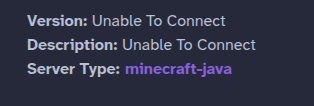
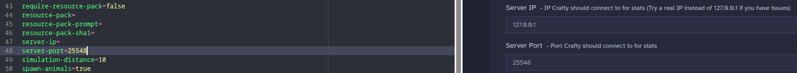

# Troubleshooting / FAQ

This document lists some common issues and how to troublshoot them

## API Key is valid but doesn't work

Make sure the user can see the server on the panel and that the API Token has the necessary access (try "Full Access" if it still doesn't work)

## Crafty reports server as running, but the plugin tries to start it anyways

Please make sure that Crafty can connect to the server.

If you see "Unable to connect" next to version or MOTD, look for an IP / Port missmatch inside of the 'Config' tab

